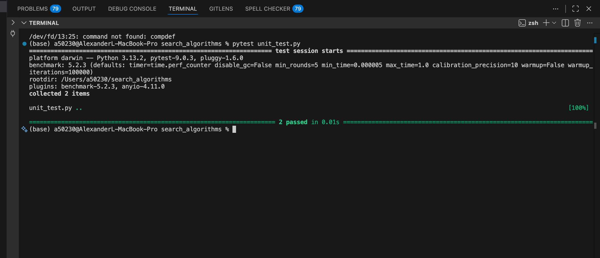
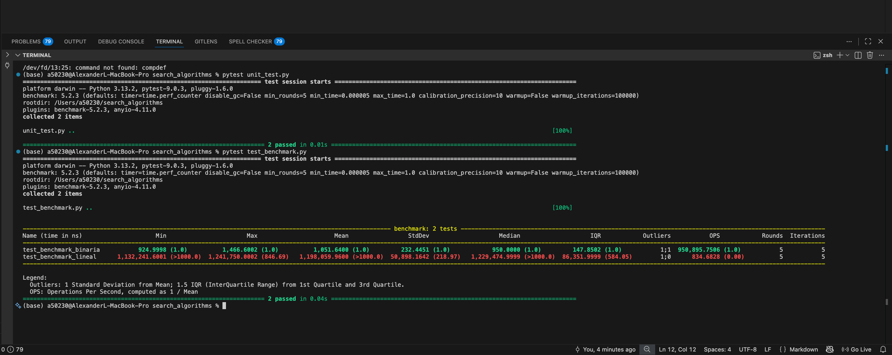

# search_algorithms

# Para ejecutar el unit testing
pytest unit_test.py

# Para ejecutar el test_benchmark 
pytest test_benchmark.py

# Para ejecutar todo de un solo 
pytest

# Capturas 

Unit test : 

Test_benchmark: 

